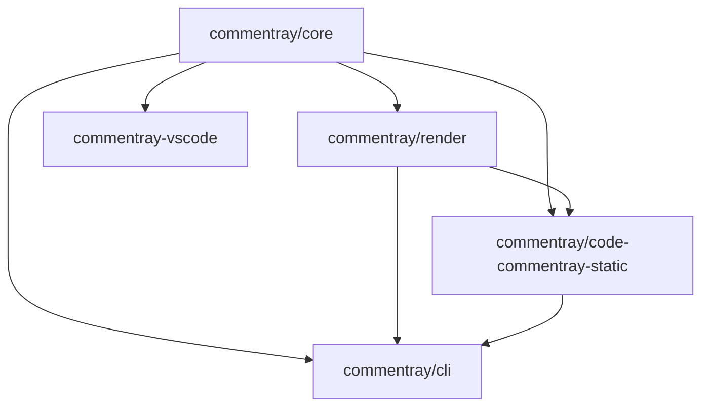

# Commentray — architecture angle

This **angle** is a second voice on the same `README.md` source: high-level map of the monorepo, not a second README. For **roles** (libraries vs tooling vs static generator), see the **[Main](https://github.com/d-led/commentray/blob/main/.commentray/source/README.md/main.md)** angle.

**Package dependencies** (edges follow `package.json` `dependencies`; `@commentray/core` has no in-repo package deps):

- **`@commentray/core`** — paths, index, config merge, Angles resolution, Git-backed evidence.
- **`@commentray/render`** — Markdown → safe HTML, static code browser shell (dual panes, optional multi-angle selector, block-aware scroll when the index agrees).
- **`@commentray/cli`** — `init`, `validate`, **`migrate-angles`** (flat → per-source folders), `render`, `pages` inputs.
- **`@commentray/code-commentray-static`** — thin consumer that feeds `renderCodeBrowserHtml` for GitHub Pages.

Use **Angle** on the static site when this file exists alongside `main.md` and both are listed under `[angles].definitions` in `.commentray.toml`.
