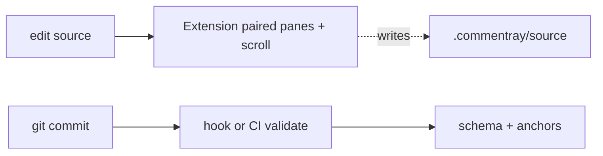

# Plan — commentray

The plan on the left is the engineering checklist; this file is the short voice-over: intent, boundaries, and what v0 deliberately does not claim.

**Metaphor** — Commentary on a film: extra audio without splicing new frames into the picture.

**Goals / non-goals** — v0 stays small; deferred work (LSP, every SCM, …) is named so absence reads as policy, not neglect.

**Angles** — Core + VS Code: add angle + pick angle (see `packages/vscode/package.json` command titles). **`@commentray/render`:** no Angle switcher. Pages: one `commentray_markdown` until static work lands.

**Block stretch** — Renderer uses **row-per-block** paired rows, not `rowspan`, when index and markers line up.

**Duplication** — The plan’s §Documentation hierarchy: source tree + README + specs are truth; plan and this file are narrative pointers.

**Packages** — Read the table as a stack: core at the bottom, render above, CLI / VS Code / static sample on top.

**Anchors (v0)** — `lines:…` and `symbol:…` are the committed dialects; blocks hang prose off those hooks (plus `marker:` where regions exist).

**Automation** — Hooks: `commentray init scm`. Local/CI gate: **`npm run quality:gate`** → `scripts/quality-gate.sh`.

**Handoff** — The plan ends with **Next session (handoff)**: reading order, command table, suggested backlog bullets, parking lot. Start there after a break.

**User-facing** — Short guides live in **`docs/user/`**; the README has **Using Commentray** with links (install, quickstart, detection, CLI, config, troubleshooting).
