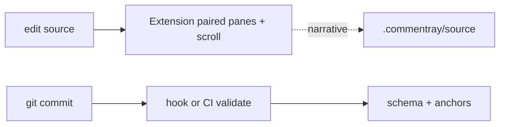

# Plan — commentray

The plan on the left is the **script**; this note is what we’d say in the booth while it plays—intent, boundaries, and where the camera will not go in v0.

**Product metaphor** — DVD-style commentary: voice-over without splicing new frames into the film.

**Goals / non-goals** — v0 is deliberately small; the plan calls out what we deferred (LSP, every SCM, …) so “not yet” does not read as “forgotten.”

**Data flow** — Mermaid in the plan’s source still renders on Pages when Mermaid is enabled; the diagram is the same idea as [`docs/spec/blocks.md`](https://github.com/d-led/commentray/blob/main/docs/spec/blocks.md) in a different costume.

**Packages** — Read the table on the left as dependency pressure: core at the bottom, render above it, surfaces (CLI, VS Code, static generator) on top.

**Anchors (v0 grammar)** — `lines:12-40` and `symbol:SomeExport` are the two dialects we committed to; blocks hang prose off those hooks.

**Hook path** — `commentray init scm`. **Full gate** — root `npm run quality:gate` → `scripts/quality-gate.sh`.
