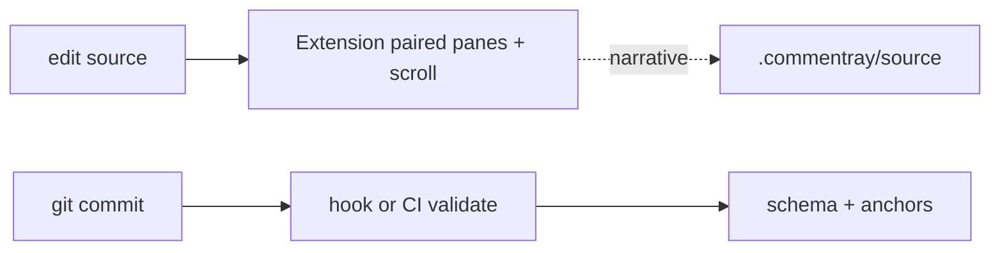

# Plan — companion

Engineering intent for the whole monorepo: product metaphor, package boundaries, CI, Pages, and what is explicitly **not** in v0.

## Map this file to the plan

| Section (approx.) | Intent                                                                                                                                 |
| ----------------- | -------------------------------------------------------------------------------------------------------------------------------------- |
| Product metaphor  | DVD-style commentary without touching the primary artifact                                                                             |
| Goals / Non-goals | v0 scope vs deferred (LSP, every SCM, …)                                                                                               |
| Data flow diagram | Mermaid in source → same idea renders on [Pages](https://github.com/d-led/commentray/blob/main/docs/spec/blocks.md) when Mermaid is on |
| Packages table    | `@commentray/core` → `render` → `cli` / `vscode` / static generator                                                                    |
| Static browser    | Split panes, wrap toggle, optional quick-search client bundle                                                                          |

## Anchors (v0 grammar)

```text
lines:12-40          # inclusive 1-based range in the primary file
symbol:SomeExport    # opaque until a language plugin resolves it
```

Blocks tie Markdown segments to those anchors; see [`docs/spec/blocks.md`](https://github.com/d-led/commentray/blob/main/docs/spec/blocks.md).

## Editor + CI split (feature tease)



Hook path: `commentray init scm`. Full gate: root `npm run quality:gate` → `scripts/quality-gate.sh`.
