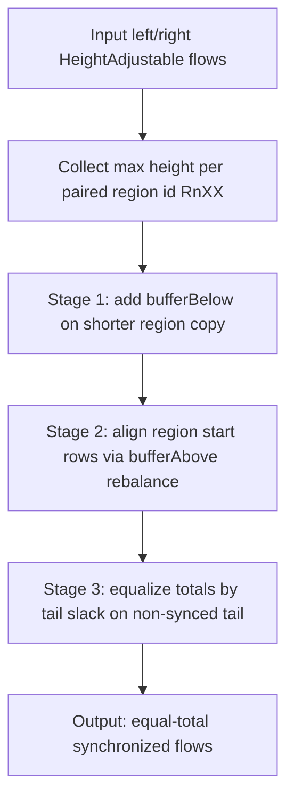

# `buffering-flow-synchronizer.ts` - commentray

Synchronizes two vertical flows by treating only `R{N}XX` as paired regions. Unsynced ids (`XXXX`, `__ANON__*`) stay local and are never region-matched across columns.

Why this shape: start alignment prefers lowering existing `bufferAbove` on the later-starting side before adding new top slack on the other side. This minimizes artificial empty rows while preserving scroll-total equality.

Approval example A: `two-columns.zig-zag-alternating-sync-needs`.
Alternating unsynced rows zig-zag between sides before `R2XX`/`R3XX`. Sync still aligns paired region starts and keeps the no-symmetric-`BBBB`-per-line invariant.

Approval example B: `two-columns.second-column-missing-first-region`.
The right column starts with `R1XX` while left starts unsynced. Sync shifts top slack where needed, then keeps later region/body rows in parity without pretending unsynced rows are paired.

DOM application is documented in `.commentray/source/packages/render/src/block-stretch-buffer-sync.ts/main.md`.