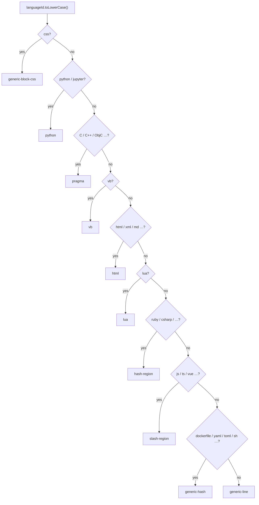

# `source-markers.ts` — commentray

Delimiters for **block anchors** in primary source: what gets inserted when wrapping a range, and what `parseCommentrayRegionBoundary` recognises on read.

## Two families

1. **Region convention** — Where editors already fold `//#region` / `//#endregion`, `#pragma region`, `<!-- #region … -->` in Markdown, etc., Commentray uses the region **name** `commentray:<id>` (aligned with [Region Marker](https://marketplace.visualstudio.com/items?itemName=txava.region-marker)).

2. **Generic markers** — Languages without a shared folding idiom use ordinary comments with `commentray:start id=<id>` / `commentray:end id=<id>` (still parsed by the same boundary parser). Legacy pairs that only use (2) remain valid everywhere.

**Insertion order:** when wrapping, apply the **end** fragment first, then **start**, so offsets stay stable (`commentrayRegionInsertions`).

**Viewport geometry:** `markerViewportHalfOpen1Based` defines a **1-based half-open** `[lo, hiExclusive)` span for scroll sync: it includes one physical line above the start delimiter and the delimiter line, runs through the last inner line, and **excludes** the end delimiter line. The blank between one block’s end marker and the next block’s start belongs to the **next** block (same as the line above the next start).

**Related:** [`block-scroll-pickers.ts`](../block-scroll-pickers.ts/main.md) · [`scroll-sync.ts`](../scroll-sync.ts/main.md) · [`docs/user/source-region-delimiters.md`](https://github.com/d-led/commentray/blob/main/docs/user/source-region-delimiters.md)

## `regionConvention(languageId)` — decision order

The implementation checks branches in a fixed order; the diagram matches `source-markers.ts`.

