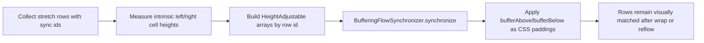

# `block-stretch-buffer-sync.ts` - commentray

This is where synchronized buffers become DOM geometry. Per stretch `<tr>` we measure intrinsic code/doc content heights, run `BufferingFlowSynchronizer`, then map `bufferAbove`/`bufferBelow` to `padding-top`/`padding-bottom` on each `<td>`.

`wireBlockStretchBufferSync` reruns this pass on `ResizeObserver`, tbody mutations, viewport resize, and Mermaid-finished events. Principle: deterministic post-measurement layout pass, not static markup assumptions.

Core algorithm details live in `.commentray/source/packages/core/src/buffering-flow-synchronizer.ts/main.md`.