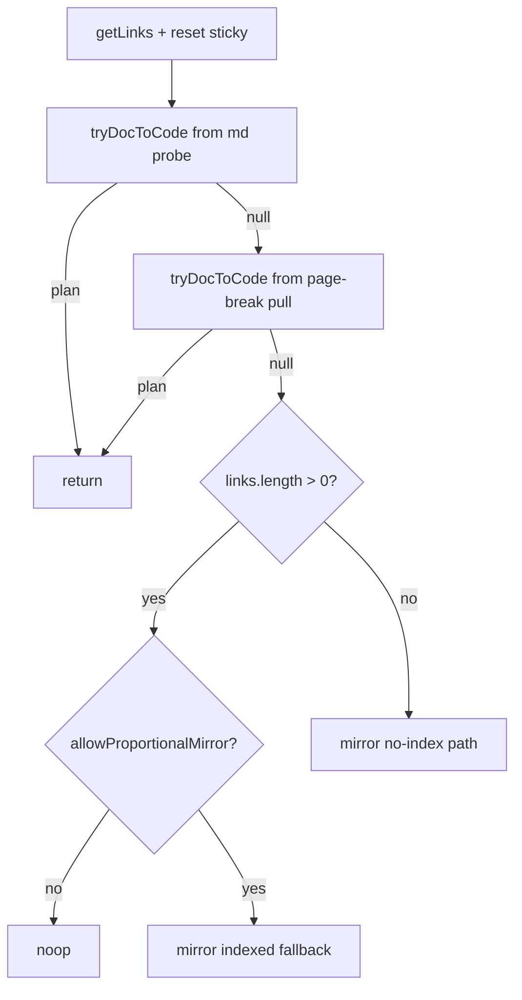

# `code-browser-client.ts` — commentray

Browser bundle wired into static HTML from [`code-browser.ts`](../code-browser.ts/main.md): dual-pane scroll sync, in-page search, hub navigation, Mermaid, theme, block-stretch client hooks, etc.

## Static hub browse links

Hub pages emit `./browse/…` relative to the site root. From a URL like `/…/browse/current.html`, the browser would otherwise resolve `./browse/…` against that folder and nest a second `browse/` segment. **`rewriteHubRelativeBrowseAnchorsIn`** rewrites those anchors using the current pathname and origin (`code-browser-pair-nav` helpers).

## Dual-pane scroll sync (high level)

Partner **`scrollTop` writes are instant** (no `behavior: "smooth"` on proportional mirrors or block reveals): smooth easing on every driver frame makes the partner chase a moving target, multiplies `scroll` events, tightens echo-suppression windows, and fights monotonicity—reads as jitter. See [`docs/spec/dual-pane-scroll-sync.md`](https://github.com/d-led/commentray/blob/main/docs/spec/dual-pane-scroll-sync.md).

- **`applyScrollTopClamped`** — proportional mirror / clamped writes; sub-pixel skip when already aligned.
- **`writePaneVerticalScrollForced`** — monotonic revert path; must not use the sub-pixel skip or the partner never moves back.
- **`enforceScrollSyncMonotonic`** — partner must not move opposite the driver on a decisive step (`code-browser-scroll-sync-monotonic`).
- **`applyRevealChildInPane`** — scrollport vs document root; always instant alignment to reading lead.

### Doc → code plan order (`buildDocToCodeFlipPlanBlockAware`)

Indexed **block** resolution runs **before** the page-break pull: `pulledSourceLine0FromPageBreak` can stay “active” across a large span up to `nextAnchor`, covering whole blocks. If page-break won first, code could snap far forward while the doc viewport is still inside an earlier block; the next block resolution then conflicts with monotonicity and code can stick hundreds of px ahead. **Page-break pull** is only used when no indexed block plan was returned (true inter-block / inter-segment gap).

### Source block trailing slack

**`SOURCE_BLOCK_TRAILING_SLACK_LINES`** (6): after the strict `[lo, hiExclusive)` span ends, the same block stays active for a few more source lines so probe noise at the boundary does not flip code→doc between block snap and gap mirror every frame.

## Scroll-sync debug tracing

Opt-in only (query, hash, or `sessionStorage` / `localStorage`)—**not** implied by `localhost` alone, so DevTools stays quiet during normal reading.

- **Enable:** `?commentrayDebugScroll=1`, `#commentrayDebugScroll`, or `sessionStorage.setItem("commentrayDebugScroll", "1")` (same key on `localStorage`).
- **Cached flag:** rechecked at most every **500ms** and on `hashchange` / `storage`, so hot scroll paths do not read storage every tick.
- **Boot line:** always logs on common dev hostnames when trace is on (stale bundle visibility); uses `console.log` at default filter level.

**Console tags** (filter `[commentray:scroll-sync]`): `code→doc.plan`, `doc→code.plan`, `code→doc.apply`, `doc→code.apply`, `wire.code.driver` / `wire.doc.driver`, `wire.*.flush-skipped`, `monotonic.revert` (`console.warn`).

**Related:** [`code-browser-scroll-sync.ts`](../code-browser-scroll-sync.ts) (re-exports core pickers) · [`block-stretch-buffer-sync.ts`](../block-stretch-buffer-sync.ts/main.md) · [`dual-pane-scroll-sync.md`](https://github.com/d-led/commentray/blob/main/docs/spec/dual-pane-scroll-sync.md)
