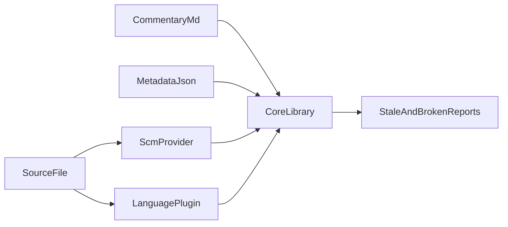

# Commentary monorepo — implementation plan

This document is the canonical engineering plan for the Commentary ecosystem. It is intentionally detailed: it captures product intent, storage conventions, package boundaries, testing tiers, CI posture, and security/publishing expectations.

## Product metaphor (README opening)

Commentary tracks on DVDs and streaming extras: optional audio where filmmakers explain choices, constraints, and intent **without** altering the film itself.

Commentary applies that metaphor to software and texts: the **primary artifact stays clean** (code, config, generated formats where inline notes are impossible), while explanations, rationale, warnings, and diagrams live beside it in companion Markdown, synchronized by **blocks** and **anchors** rather than by fragile line numbers alone.

The user-facing README should remain **terse and skimmable**, in the spirit of [chumak’s README](https://raw.githubusercontent.com/zeromq/chumak/refs/heads/master/README.md).

## Goals (v0)

- **Out-of-file docs** under `.commentary/` with transparent paths: `.commentary/source/<repo-relative-path>.md` (append `.md` to the original path; normalize separators; reject `..`).
- **Block model**: commentary segments align to code ranges; UI layout is **code left, commentary right** (GitHub blame–style columns) with **scroll sync** while editing and viewing.
- **Anchoring & drift**: metadata records evidence (symbol names when available, line ranges, Git blob SHA, commits, timestamps). **Git is the default SCM** behind a pluggable `ScmProvider` interface (`git` CLI first).
- **Staleness**: non-blocking diagnostics for humans and automation (including LLM agents).
- **IDE**: default integration is **VS Code** (extension MVP ships in this repo).
- **Language plugins**: pluggable resolvers per language; v0 focuses on core anchor parsing + TypeScript-friendly workflows, expanding later.
- **Rendering**: `@commentary/render` provides Markdown → HTML with sanitization, highlighting, Mermaid containers, and HTML shells (simple side-by-side plus an interactive **static code browser** page).
- **Static code browser sample**: the `code-commentary-static` package emits a self-contained HTML file: highlighted code, rendered Markdown commentary, a **draggable vertical splitter**, and a **line-wrap toggle** for the code pane (client-side persistence via `localStorage`).
- **Manipulation library**: `@commentary/core` owns models, validation, migrations, and staleness helpers.
- **CLI**: `@commentary/cli` provides `init` (full idempotent setup), `init config`, `init scm` (git hooks), `validate`, `doctor`, `migrate`, `render`, and `paths`; **standalone SEA binaries** for Linux (x64, arm64), macOS (x64, arm64), and Windows (x64) are built in [`.github/workflows/binaries.yml`](../../.github/workflows/binaries.yml) and attached to GitHub Releases on `v*` tags.
- **Monorepo**: TypeScript, semantic versioning, packages start at **0.0.1**, **MPL-2.0** per published package.
- **Config**: `.commentary.toml` at repo root with sensible defaults.
- **Tooling**: Prettier for TS/JS/JSON/Markdown; ESLint for TS; Vitest at multiple tiers.
- **CI**: GitHub Actions runs quick checks broadly; expensive workflows are opt-in.
- **npm publishing**: prefer **OIDC trusted publishing** + **npm provenance**; avoid long-lived tokens.

## Non-goals (initial iterations)

- Replacing language-native doc systems (Rustdoc, Javadoc, …).
- Fully autonomous AI synchronization (ship diagnostics and machine-readable reports first).
- Every SCM backend on day one (interfaces yes; extra backends later).

## Repository layout

```text
.commentary.toml
.commentary/
  metadata/
  source/
packages/
  core/
  render/
  code-commentary-static/
  cli/
  vscode/
scripts/
  ci-quick.sh
  ci-full.sh
  format.sh
  format-check.sh
  lint.sh
  test.sh
  test-coverage.sh
  build-static-pages.mjs
docs/
  plan/plan.md
  spec/
.github/workflows/
  ci.yml
  ci-expensive.yml
  pages.yml
```

## Data flow (high level)



## Normative specs (docs)

- Storage paths: [`docs/spec/storage.md`](../spec/storage.md)
- Anchor grammar: [`docs/spec/anchors.md`](../spec/anchors.md)
- Blocks: [`docs/spec/blocks.md`](../spec/blocks.md)

## Packages

| Package                  | Responsibility                                                                                       |
| ------------------------ | ---------------------------------------------------------------------------------------------------- |
| `@commentary/core`       | Types, JSON validation, migrations, Git SCM adapter, anchor parsing, staleness                       |
| `@commentary/render`     | remark/rehype pipeline, sanitize, highlight, Mermaid, HTML shells (incl. interactive static browser) |
| `code-commentary-static` | Sample static site generator: one HTML file, resizable panes, code wrap toggle                       |
| `@commentary/cli`        | CLI commands and CI-friendly exit codes                                                              |
| `commentary-vscode`      | Editor UX: paired panes, scroll sync prototype, workspace validation output channel                  |

## Configuration (`.commentary.toml`)

Defaults (illustrative):

- `storage.dir = ".commentary"`
- `scm.provider = "git"`
- `render.mermaid = true`
- `render.syntaxTheme = "github-dark"`
- `anchors.defaultStrategy = ["symbol", "lines"]`
- **`[static_site]`** (optional): drives the GitHub Pages build (`npm run pages:build` → `_site/index.html`):
  - `title` — browser / toolbar title for the static code browser page
  - `intro` — Markdown prepended in the commentary pane (before the GitHub link and optional file body)
  - `github_url` — URL for a “View repository on GitHub” link
  - `source_file` — repo-relative path whose contents fill the **code** pane (default `README.md`)
  - `commentary_markdown` — optional repo-relative path to extra Markdown appended in the commentary pane

Implementation note: configuration parsing uses `@iarna/toml` today; dependency choices should be revisited periodically for maintenance and security posture.

## Static code browser (`code-commentary-static`)

- **Purpose**: dogfood and demo a file-plus-commentary reading experience without a server.
- **Implementation**: `renderCodeBrowserHtml` lives in `@commentary/render`; `code-commentary-static` wires fixtures + CLI (`npm run site -w code-commentary-static`) and writes to `packages/code-commentary-static/site/` (gitignored).
- **GitHub Pages**: root script `npm run pages:build` reads `.commentary.toml` `[static_site]`, composes commentary (intro + GitHub link + optional file), and emits `_site/index.html` via `scripts/build-static-pages.mjs`. Workflow `.github/workflows/pages.yml` runs on `main` + `workflow_dispatch` using `actions/upload-pages-artifact` + `actions/deploy-pages` (repository **Settings → Pages → Build: GitHub Actions**).
- **UX**: movable vertical bar (mouse drag), “Wrap code lines” checkbox, Highlight.js themes via CDN, Markdown + Mermaid (optional).
- **Quick search**: client-side whole-source ordered tokens plus per-line fuzzy ranking (bundled client); see `packages/render` implementation.

## Markdown rendering stack

- Baseline: **remark** + **GFM** + **rehype** stringify.
- Sanitization: **rehype-sanitize** with an explicit allowlist extension for highlighting classes.
- Highlighting: **rehype-highlight** (lowlight grammar ecosystem).
- Mermaid: fenced `mermaid` blocks become `<pre class="mermaid"><code>…</code></pre>`; optional CDN runtime injection for HTML previews.

## Testing matrix (Vitest)

- **Unit**: `vitest.config.ts` (fast, default local + CI quick path).
- **Integration**: `vitest.integration.config.ts` (Git fixture repos).
- **Expensive**: `vitest.expensive.config.ts` (reserved for fuzz/perf/large-repo simulations).
- **Coverage**: `npm run test:coverage` (unit + HTML/`lcov`/`json-summary` under `./coverage/`, opens `coverage/index.html` when possible); `npm run test:coverage:all` includes integration tests (requires a working `git` CLI).

## Scripts policy

Every recurring workflow exists as:

- an **`npm run …`** task at the repo root, and/or
- a **`scripts/*.sh`** entry that resolves the repo root from the script location and `cd`s there.

## GitHub Actions

- `ci.yml`: `npm ci`, optional `npm audit` (informational), `bash scripts/ci-quick.sh`, `npm run test:integration`.
- `ci-expensive.yml`: `workflow_dispatch` and PR label `run-expensive-ci`, runs `npm run test:expensive`.
- `pages.yml`: `npm run pages:build` then deploy `_site/` to **GitHub Pages** (on `main` and manual dispatch).

Maintainers can tighten expensive jobs later using GitHub Environments and required reviewers.

## Licensing

Root `LICENSE` is MPL-2.0 (Mozilla template). Each publishable package includes its own `LICENSE` copy for npm packaging clarity.

## Contribution guide

`CONTRIBUTING.md` states the C4 aspiration (via the chumak reference) and the pragmatic, incremental reality.

## Open technical choices (next iterations)

1. **Language intelligence**: expand beyond minimal anchors using tree-sitter and/or LSP-backed resolvers.
2. **VS Code**: evolve toward webview preview parity with `@commentary/render` output and richer block gutter UX.

## Implementation status (living)

This repository contains an initial vertical slice: monorepo scaffolding, core library, renderer, static code browser sample (`code-commentary-static`), CLI, VS Code MVP, tiered Vitest configs, and baseline GitHub Actions.

Next steps are intentionally incremental: expand metadata richness, improve anchor resolution plugins, tighten editor diagnostics, and add more integration coverage as real repositories adopt Commentary.
